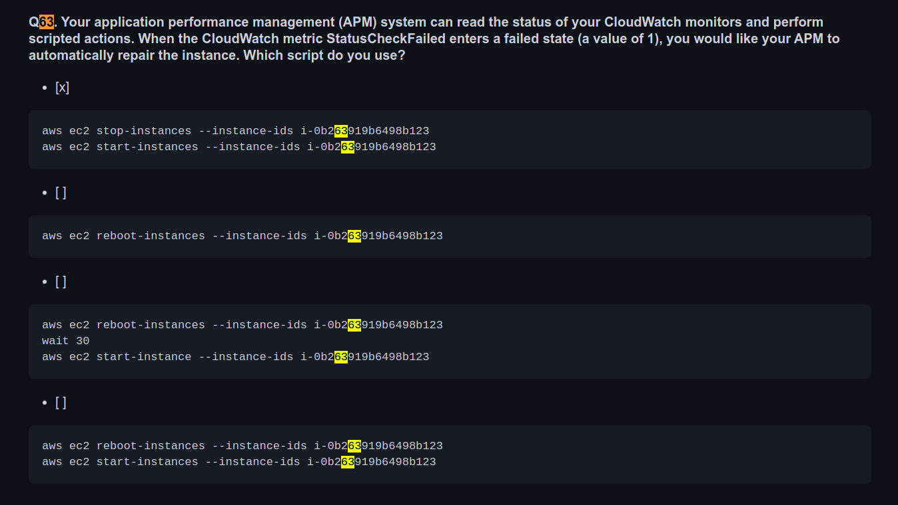
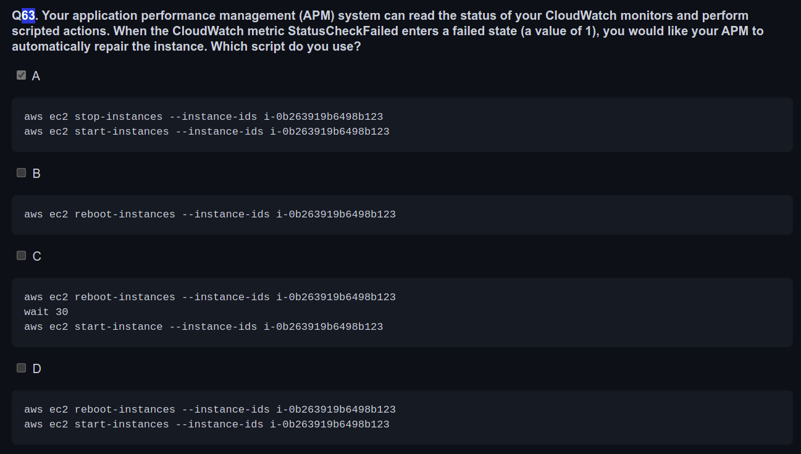
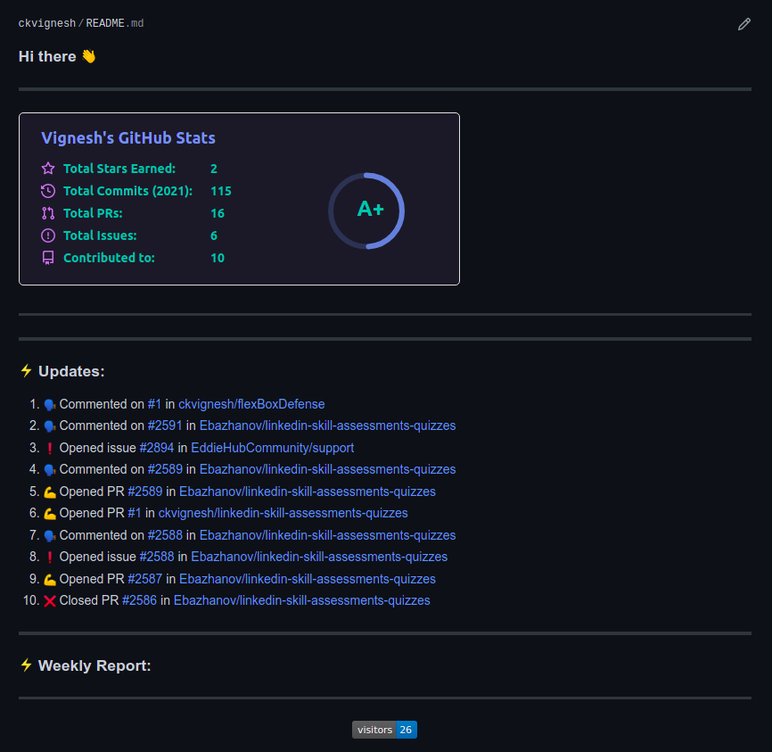
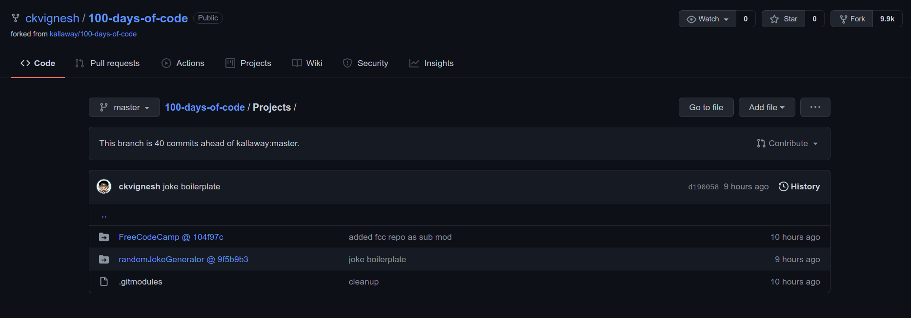

# 100 Days Of Code - Log
## Round 1

***
|**Round**| **Day**|                                    **Topics**                                |
|:-------:|:------:| :---------------------------------------------------------------------------:|
| 1       |      1 |  [CSS - fCC & flexbox froggy](#day-1-october-25-2021)                        |
| 1       |      2 |  [CSS - fCC & grid garden](#day-2-october-26-2021)                           |
| 1       |      3 |  [CSS - fCC & FOSS Contribution](#day-3-october-27-2021)                     |
| 1       |      4 |  [CSS - Flexbox defense & FOSS Contribution](#day-4-october-28-2021)         |
| 1       |      5 |  [Markdown file formatting](#day-5-october-29-2021)                          |
| 1       |      6 |  [HTML - fCC revision](#day-6-october-30-2021)                               |
| 1       |      7 |  [OS Contributions](#day-7-october-31-2021)                                  |
| 1       |      8 |  [OS Contributions](#day-8-november-1-2021)                                  |
| 1       |      9 |  [Github Profile](#day-9-november-2-2021)                                    |
| 1       |     10 |  [Github Profile](#day-10-november-3-2021)                                   |
| 1       |     11 |  [Github Profile](#day-11-november-4-2021)                                   |
| 1       |     12 |  [JS Day 1](#day-12-november-5-2021)                                         |
| 1       |     13 |  [JS Day 2](#day-13-november-6-2021)                                         |
| 1       |     14 |  [Resume Page](#day-14-november-7-2021)                                      |
| 1       |     15 |  [Resume Page](#day-15-november-8-2021)                                      |
| 1       |     16 |  [Resume Page](#day-16-november-9-2021)                                      |
| 1       |     17 |  [Pull Request](#day-17-november-10-2021)                                    |
| 1       |     18 |  [Resume Page](#day-18-november-11-2021)                                     |
| 1       |    nil |  [Break](#november-12-2021)                                                  |
| 1       |     19 |  [Gatsby](#day-19-november-13-2021)                                          |

### Day 1: October 25, 2021
Monday

**Today's Progress:**
- Finished the CSS Part of RWD Certification on freeCodeCamp.
- Finished Flexboxfroggy Level 24.

**Thoughts:** 
- This was a bit challenging. But, I could go through this quite soon because I had some experience with CSS before.
- I had completed 23 levels of FlexboxFroggy before. But I was stuck at the 24th level. Today, I completed it and made it as a Repo with proof.

**Link to work:**
- [Responsive Web Design](https://github.com/ckvignesh/FreeCodeCamp/tree/master/Responsive%20Web%20Design/CSS)
- [Flexbox Froggy](https://github.com/ckvignesh/flexboxFroggySolution)

***
### Day 2: October 26, 2021 
Tuesday

**Today's Progress:**
- Finished 28/52 in the Applied Visual Design of RWD Certification on freeCodeCamp.
- Finished all the levels of Grid Garden game.
- Learnt that "***" is used for drawing a line in the markdown.

**Thoughts:** 
- Some concepts were totally new for me. I also realized that I made some stupid mistakes due to leaving extra spaces. 
- I completed all 28 levels of Grid Garden. But I was stuck at the 28th level. I had to take some help to understand it better. I faced difficulty in the 26th level too but I could solve it on my own. Therefore, I will repeat the last few levels of this game again tomorrow.

**Link to work:**
- [Responsive Web Design](https://github.com/ckvignesh/FreeCodeCamp/tree/master/Responsive%20Web%20Design/CSS)
- [Grid Garden](https://github.com/ckvignesh/gridGardenSolution)
- The [Markdown](https://github.com/ckvignesh/100-days-of-code/blob/master/log.md) file that you're now viewing.
  
***

### Day 3: October 27, 2021 
Wednesday

**Today's Progress:**
- Finished 30/52 in the Applied Visual Design of RWD Certification on freeCodeCamp.
- Made an Open Source contribution in the Open Product Management Repo.
- Studied the use of Var, Let and Const in JS.

**Thoughts:** 
I could do only one hour of coding today. It was a low in my graph of this challenge. Nor did I play any code game.
- Learnt how to use the Hue and transparency adjustments in CSS from the freeCodeCamp course.
- Made my second Open Source contribution in the Open Product Management Repo. Added some missing links and raised a PR. Waiting for its status to get updated.
- Var is globally scoped, Let and Const are block scoped. Var can be declared and updated but it can mess with the code if its a longer one as the values may get messed up. Let and Const are preferrable. Let can be updated but not declared again and it need not be initialised. Const cannot be updated or declared again and it needs to be initialised.

**Link to work:**
- [Responsive Web Design](https://github.com/ckvignesh/FreeCodeCamp/tree/master/Responsive%20Web%20Design/Applied%20Visual%20Design)
- [Open Product Management Pull Request](https://github.com/ProductHired/open-product-management/pull/100)
  
***

### Day 4: October 28, 2021 
Thursday

**Today's Progress:**
- Solved all 12 Levels of Flexbox Defense Game.
- Reviewed and accepted some Open Source contributions.
- Made an OS Contribution.
- Added some features to a public Repo.
- Learnt about the break tag and code notation(``) in Markdown.

**Thoughts:** 
- After enough practise, CSS Games have become easy to solve. Now I must focus more on making some real projects. I can schedule games for weekends or during any other free time.
- I got a PR from an online friend who's also studying coding with me. Doing Open Source has taught me a lot and I could also review and edit code, handle issues and merge the PR.
- I added a small part to the documentation by specifying that the program could be run on any port by adding the number before it.
- I forked a simple quiz repo and added some features to it (like change in score patterns). It was in Next Js and Tailwind CSS. Though I knew nothing about both, I was able to handle it since I had worked on CSS and React before. I also raised an issue regarding this.
- The Open Source Contributions also taught me about the break tag and the coding format (``). This was from the contributions in the PRs I got.

**Link to work:**
- [Flexbox Defense](https://github.com/ckvignesh/flexBoxDefense)
- The Pull Requests: 
- [Open Source Contribution](https://github.com/akramkazmi71/hacktoberfest-xrepos/pull/61). It was accepted, too! Check this: 
- [Quiz Repo Display edits](https://github.com/ckvignesh/quizz-game/commits/Suggestions) and [Quiz Repo Logic edits](https://github.com/ckvignesh/quizz-game/commits/nonNegativeMarking).
  
***

### Day 5: October 29, 2021 
Friday

From now, my plan would be to study JS along with HTML, CSS and the rest of the RWD fCC certification. Putting off CSS games for now.

**Today's Progress:**
- Learnt more features of Markdown files like adding index tables, sectional link, aligning text in boxes etc.

**Thoughts:** 
- Today's progress was very slow and poor. 

**Link to work:**
- [This markdown file you're reading now.](log.md)
***

### Day 6: October 30, 2021 
Saturday

Today was also very slow. I had a busy day.

**Today's Progress:**
- Re did the HTML course of fCC RWD Cert as I felt I lost touch.
- Raised an issue on Github for a deployment that was not working.

**Link to work:**
- This:    and [this](https://github.com/ckvignesh/FreeCodeCamp/tree/master/Responsive%20Web%20Design/HTML).
- [Issue Raised](https://github.com/fefong/markdown_readme/issues/2).
***

### Day 7: October 31, 2021 
Sunday

Today's the last day of #Hacktoberfest.

**Today's Progress:**
- Contributed to a simple OS Project.
- Studied a bit of Javascript from Eloquent Javascript.
- Drafted ideas for my Portfolio Page.

**Link to work:**
- [OS Commit](https://github.com/GabeNedden/contribute/commit/acfbbf02e2d7b103ee664bb15b03edf7456f90b0)
- [My first Project](https://codepen.io/ckvignesh/pen/PoKpqjr)
***

### Day 8: November 1, 2021 
Monday

Busy days ahead. But I'll spend some time doing OS Contributions though the #Hacktoberfest is officially over.

**Today's Progress:**
- Formatted some answers in an OS Repo md file & raised a PR. (BTW this is accepted now as on Nov 2nd)
  Before:   After: 
- Studied a bit of Javascript from Eloquent Javascript.

**Link to work:**
- [OS Commit](https://github.com/Ebazhanov/linkedin-skill-assessments-quizzes/pull/2589)
- [OS Commit](https://github.com/Ebazhanov/linkedin-skill-assessments-quizzes/pull/2587)
- PR Merged:
  

  
***

### Day 9: November 2, 2021 
Tuesday

I spent my day exploring new concepts in Github and how to implement them. Included a small test project that I'll be enhancing later in this challenge. My github page looks like this, now.

**Today's Progress:**
- I went through [Eddie Jaoude's free Github Course](https://www.eddiejaoude.io/course-github-profile/index) and improved my Github Page.
- Also learnt about Github Submodules that I implemented in this Repo.

**Link to work:**
- [My github home page](https://github.com/ckvignesh/ckvignesh).
  
- The [Projects](./Projects/) folder I created in this Repo to map 2 projects I'm working on.
  
- Certificate from [Eddie Jaoude's free Github Course](https://www.eddiejaoude.io/course-github-profile/index).
  

**Learning:**
- Github Submodules that I documented [here](https://vigneshck-online.codes/github-submodules-and-how-you-can-use-them-for-your-projects).
- The changes in submodules won't be shown in the parent module unless they are added and committed. Like this.   Before:    and After:   
  
  ***
### Day 10: November 3, 2021 
Wednesday

Today was a hectic day as I spent a lot of time exploring new things. I wrote an article and committed to the 2 articles per week challenge.

**Today's Progress:**
- Scoured through some Github Profiles and revamped my profile to make it look better.
- Raised a PR to merge my Github Profile in the list of awesome [Github Profiles](https://github.com/EddieHubCommunity/awesome-github-profiles).
- Shortlisted a template in Jekyll to create my [new website](https://ckvignesh.github.io/). Shelved the old one & kept it aside just for documenting.

**Link to work:**
- [My github home page](https://github.com/ckvignesh)      New widgets:     
- [My PR that's showing some error now.](https://github.com/EddieHubCommunity/awesome-github-profiles/pull/828) Update: it got resolved after a reviewer requested changes & I followed their corrections. PR Merged and closed.
- [Template for my new website.](https://github.com/kitian616/jekyll-TeXt-theme)

***
### Day 11: November 4, 2021 
Thursday

Felt burntout as I spent most of today's first half coding. Learnt to use the automated kanban board in Github Projects. Started one for my portfolio and resume page after I finalised my themes and another to work on my Github Landing Page.
It looked like this before I started work on my Jekyll websites   . Here, CSS was the most used language. Now, things have changed due to my new projects.      But, I've decided to go ahead with React for my portfolio page. Only the Resume Page and the Under Construction Page will be in Jekyll.

**Today's Progress:**
- Built an Under Construction Page for my upcoming website.
- Started using Github Projects and learnt how automated Kanban works. Broke down tasks for Resume Page & Github Landing Page.
- Working on my resume page. Added data after studying the Jekyll Page Template. Have to make more customizations.

**Link to work:**
- Under Construction Page for my [upcoming website](http://ckvignesh.github.io/). Take a look, here:   
- Work in progress [Resume Page](http://ckvignesh.github.io/resume).
- Github Project Board (will reveal once the main portfolio site is aired).

***

### Day 12: November 5, 2021 
Friday

Started discovering and researching on Gatsby. Cleared the old Jekyll Template for the main site.

**Today's Progress:**
- Finished Day 1 of 30 Days of JS by Asabeneh
- Studied how Gatsby Pages are made

**Link to work:**
- The answers of Day 1 of 30 Days of JS are [here](https://github.com/ckvignesh/30-Days-Of-JavaScript/tree/answers/01_Day_Introduction/day1Answers).

***
### Day 13: November 6, 2021 
Saturday

Polished my resume website and its ready for Production.

**Today's Progress:**
- Completed my Resume Website upto a great level & it's now worth showing. But, the development on it will be a continuous process.
- Built a sample gatsby website just to know how it works.

**Link to work:**
- Resume Website is [here](https://github.com/ckvignesh/resume).
- Sample Gatsby Website is on the test branch in this Repo [here](https://github.com/ckvignesh/ckvignesh.github.io/tree/testBranch).

***

### Day 14: November 7, 2021 
Sunday

**Today's Progress:**
- Worked on my Resume Page

**Link to work:**
- Resume Website is [here](https://github.com/ckvignesh/resume).

***

### Day 15: November 8, 2021 
Monday

**Today's Progress:**
- Added the Hashnode Logo and link to my Resume Website.

**Link to work:**
- Resume Website is [here](https://github.com/ckvignesh/resume).

***

### Day 16: November 9, 2021 
Tuesday

**Today's Progress:**
- Resolved a bug on my Resume Website. The links were not working properly.
- Raised a PR for Linkfree and made necessary changes.

**Link to work:**
- Resume Website is [here](https://github.com/ckvignesh/resume).
- [Pull Request](https://github.com/EddieHubCommunity/LinkFree/pull/652) for Linkfree.

***

### Day 17: November 10, 2021 
Wednesday

**Today's Progress:**
- Studied some Javascript from Eloquent JavaScript book.
- Worked on some suggested reviews of my PR.

**Link to work:**
- [Pull Request](https://github.com/EddieHubCommunity/LinkFree/pull/652) for Linkfree. It's currently accepted.

***
### Day 18: November 11, 2021 
Thursday

**Today's Progress:**
- Worked on building my portfolio site & made some changes to the under construction page.
- Added some more content to my Resume Page and merged the blog link branch.

**Link to work:**
- [Working Branch](https://github.com/ckvignesh/ckvignesh.github.io/tree/construction).
- Resume Website is [here](https://github.com/ckvignesh/resume).

***

### November 12, 2021 
Friday

This is the first day I am taking a break from coding.

***

### Day 19: November 13, 2021 
Saturday

**Today's Progress:**
- Explored more of Gatsby & read a bit from Eloquent JavaScript.

***

## Day 20: November 14, 2021

