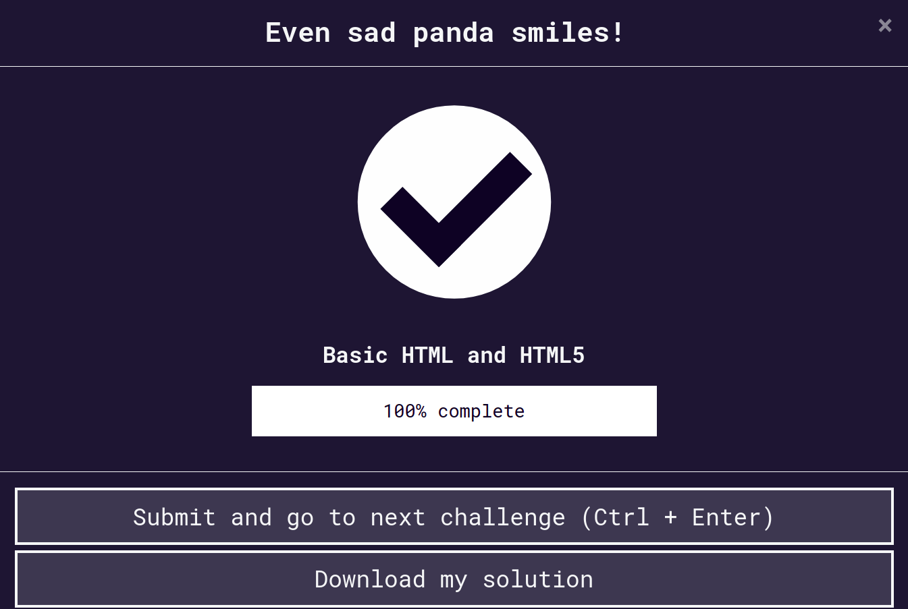

# #100DaysOfCode Log - Round 1 - [Vignesh C K]

The log of my #100DaysOfCode challenge. Started on [October 25, Monday, 2021]. You can check the detailed Log [here](https://github.com/ckvignesh/100-days-of-code/blob/master/log.md).

## Log

### R1D1 October 25, 2021

- [Responsive Web Design](https://github.com/ckvignesh/FreeCodeCamp/tree/master/Responsive%20Web%20Design/CSS)
- [Flexbox Froggy](https://github.com/ckvignesh/flexboxFroggySolution)

### R1D2 October 26, 2021
- [Responsive Web Design](https://github.com/ckvignesh/FreeCodeCamp/tree/master/Responsive%20Web%20Design/CSS)
- [Grid Garden](https://github.com/ckvignesh/gridGardenSolution)
- The [Markdown](https://github.com/ckvignesh/100-days-of-code/blob/master/log.md) file that you're now viewing.

### R1D3 October 27, 2021

- [Responsive Web Design](https://github.com/ckvignesh/FreeCodeCamp/tree/master/Responsive%20Web%20Design/CSS)
- [Open Product Management Pull Request](https://github.com/ProductHired/open-product-management/pull/100)

### R1D4 October 28, 2021

- [Flexbox Defense](https://github.com/ckvignesh/flexBoxDefense)
- The Pull Requests: 
- [Open Source Contribution](https://github.com/akramkazmi71/hacktoberfest-xrepos/pull/61). It was accepted, too! Check this: 
- [Quiz Repo Display edits](https://github.com/ckvignesh/quizz-game/commits/Suggestions) and [Quiz Repo Logic edits](https://github.com/ckvignesh/quizz-game/commits/nonNegativeMarking).

### R1D5 October 29, 2021
- [This markdown file you're reading now.](log.md)

### R1D6 October 30, 2021

- This:    and [this](https://github.com/ckvignesh/FreeCodeCamp/tree/master/Responsive%20Web%20Design/HTML).
- [Issue Raised](https://github.com/fefong/markdown_readme/issues/2).

### R1D7 October 31, 2021

- [OS Commit](https://github.com/GabeNedden/contribute/commit/acfbbf02e2d7b103ee664bb15b03edf7456f90b0)
- [My first Project](https://codepen.io/ckvignesh/pen/PoKpqjr)

### R1D8 November 1, 2021

- [OS Commit](https://github.com/Ebazhanov/linkedin-skill-assessments-quizzes/pull/2589)
- [OS Commit](https://github.com/Ebazhanov/linkedin-skill-assessments-quizzes/pull/2587)